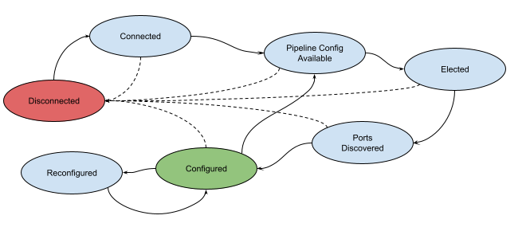

<!--
SPDX-FileCopyrightText: 2022 Intel Corporation

SPDX-License-Identifier: Apache-2.0
-->

# link-agent
Switch local agent responsible for discovery of ingress links via LLDP packets (µONOS Architecture)

##  Motivation
The primary purpose of the link local agent is to support µONOS scalability goals by decentralizing the link discovery via LLDP packet emissions and intercepts. It emits LLDP packets to be seen by link agents of the neighboring devices and intercepts incoming LLDP packets emitted by them. It allows centralized link discovery to obtain the learned ingress links via gNMI. Reasonable steps will be taken to allow this component to be used in context outside of µONOS architecture.

## Operation
The basic operation of the link local agent can be summarized as follows:

+ On start, if one hasn't been supplied explicitly, the agent will load its UUID
  + If one hasn’t been saved yet, it will generate one and save it
+ Agent will start its gNMI server
  +	get requests will allow reading agent UUID and link inventory state
  +	subscribe requests will allow streaming of link inventory state updates
  +	set requests will allow customizing link agent operation:
    + LLDP emit frequency, link stale age, port exclusions, etc.
+ Agent will start its link discovery controller, or controller for short
  + `Disconnected` state
+ The controller will establish P4Runtime connection to the Stratum agent
    + It will block until connection established, transitioning to `Connected` state 
+ After establishing the connection, the controller will inquire about the P4Info and Cookie via the P4Runtime client and parse the P4Info to generate controller metadata codec – for producing packet-out metadata and consuming packet-in metadata.
   + On success, the controller will transition to `PipelineConfigAvailable` state
   + It will periodically ask for the cookie to assert that pipeline configuration hasn’t changed
   + When change is detected, controller will re-obtain the P4Info and Cookie and use the P4Info to re-generate metadata codec
     + On change, the controller will transition back to `PipelineConfigAvailable` state
   + This is intended to avoid hardcoding any metadata IDs that might be subject to change with an evolution of the p4 program; this includes role_agent_id for packet_in filter in the subsequent role arbitration
+ From the `PipelineConfigAvailable` state, the controller will (re)negotiate mastership for its `link_local_agent` role, using role_agent_id obtained from the P4Info
   + It will continue to retry on failure
+ Once the mastership arbitration is established, the controller will install LLDP ethType punt-to-cpu intercept rule via its P4Runtime client
   + Controller will re-assert the presence of the rule when it detects no LLDP packets after a certain time
   + Note: Possibly make this configurable to allow the intercept rule to be installed by an external entity, e.g. ONOS classic or a shared resource manager
+ Independently, after mastership is negotiated, the controller will learn Stratum ports via gNMI get `interfaces/interface[name=...]/state`, searching for `id` and `oper-status`
   + Port discovery will be re-run periodically (say every minute or so) to detect new chassis configuration
  + On success, the controller will transition to `PortsDiscovered` state
+ Once ports are initially discovered, controller will start to process LLDP packet-in notifications and convert these into ingress link records and periodically emit LLDP packet-out requests on all ports.
   + Controller will emit LLDP packets only; no BDDP packets
+ Periodically, stale ingress links will be pruned
   + Stale means link exists, but last LLDP was packet received too long ago
   + Bypass the pruning action when link stale age parameter is set to 0
+ Any changes/updates to the link inventory state will be forwarded onto any existing subscriber streams
   + Only events for new and deleted/stale links will be sent
   + Link will be expressed as a tuple of (ingress port ID, egress port ID, egress device UUID) where port ID is a number, not the port name; ingress device UUID is implied

## Miscellaneous Notes
+ gNMI set may need to allow for ports and links to be injected in support of IPU deployments (this is one possible solution to the IPU limitations)
+ Care may need to be taken to prevent link flapping, especially due to misconfiguration or owing to the interaction between the discovery and pruning mechanisms
+ Current plan is to generate agent UUID, but should a sufficiently unique and ubiquitous identifier become available from the Stratum agent (e.g. openconfig-system:state/hostname), it can take the place of the agent UUID
+ Only the agent UUID and agent configuration will be persisted; all other state will be derived from the environment after agent (re)start

